# Architecture

## 6. Plane separation and staleness windows

### Trust boundaries (diagram 03)

Each trust zone is its own SPIFFE trust domain. The two domains meet only through the attested
channel and a TRAIN verdict; they are never merged. Data-plane calls into the management plane are
denied by default, and a workload without an SVID or running an unsigned image cannot join or
start.

Source: [`diagrams/03-trust-boundaries.mmd`](diagrams/03-trust-boundaries.mmd).

### Allow matrix (data plane → management plane)

Default DENY at both layers (NetworkPolicy and mesh AuthorizationPolicy). These are the only
permitted paths:

| From data-plane workload → | Allowed? | Path/layer that enforces |
|---|---|---|
| PDP adapter → TSA policy engine | ALLOW (mTLS, named pair) | mesh policy |
| aTLS gateway → cmcd / TCR resolve | ALLOW (named pair) | mesh policy |
| workloads → OTel collector (export only) | ALLOW (declared bypass, ZT-26) | mesh policy, egress-restricted |
| workloads → DNS | ALLOW (declared bypass) | NetworkPolicy port 53 |
| backend → Keycloak token endpoint / verification service | ALLOW (named pairs) | mesh policy |
| anything else data → management (SPIRE server, ArgoCD, OpenBao, TSPA, Harbor, estserver, admin APIs) | **DENY** | both layers; ZT-55 matrix test |

### Staleness matrix

Maximum window in which a revoked or rotated artefact still authorises. All values are proposed.

| Artefact | Rotation/lifetime | Cache | Max stale-authorisation window |
|---|---|---|---|
| SVID | 1 h TTL | in-process | ≤ 1 h (mesh) |
| Keycloak/issuer JWKS | rotate on demand | guard cache 5 min | ≤ 5 min |
| Access token | 300 s lifetime | — | ≤ 300 s after revocation of its basis |
| Policy bundle | poll 60 s | TSA cache | ≤ 60 s |
| Trust list / measurement | TTL 300 s | TCR/gateway | ≤ 300 s + channel lifetime 15 min ⇒ ≤ ~20 min for an established channel (bounded by channel re-establishment) |
| Credential revocation | checked per verification | outcome TTL 120 s | ≤ renewal interval (≤ token lifetime 300 s) + 120 s |
